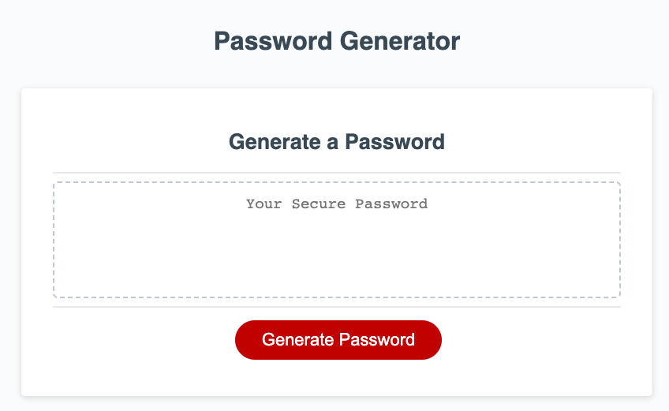
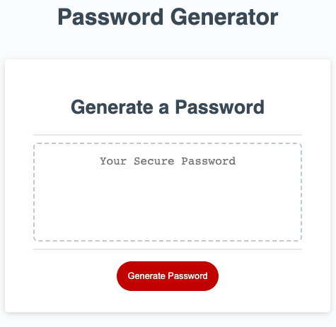
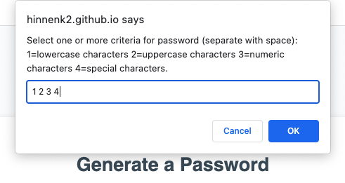
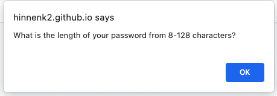
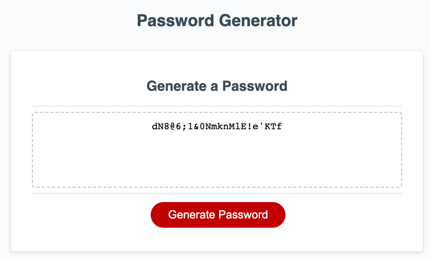

# javascript-password-generator
This application generates random passwords using JavaScript

1. [ Description. ](#desc)
2. [ Web Address. ](#web-address)
3. [ Usage tips. ](#usage)
4. [ End Result. ](#endresult)

<a name="desc"></a>
## 1. Description


### This is a password generator for the javascript challenge


Desktop screen:



Smaller devices screen:



<a name="web-address"></a>
## 2. How to Get There

### Copy and Paste to your browser of choice and start the application!

```html
https://hinnenk2.github.io/javascript-password-generator/
```
<a name="usage"></a>
## 3. Usage Tips

### Click Generate Password and Select your Criteria




### Follow the Prompted Instructions and Retrieve your New Password!

<a name="endresult"></a>
## 4. End Result

